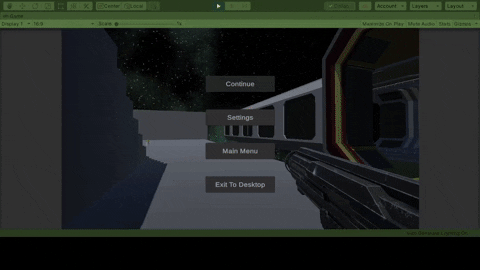

# Badlands

**Prototype** Shooter in Unity

***Controls***
- ```WASD```: Movement
- ```Left Click```: Shoot
- ```Space```: Jump
- ```Q```: Skill

***Classes Available***
- :white_check_mark:Technician: equipped with a turret skill. 
- :x:Medic: can shoot a heal blade which creates a pulse that recovers players in 10m radius.
	- Its not ready, but almost done.

